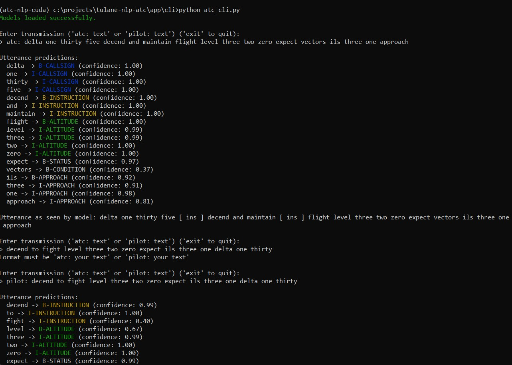

## Introduction

Accurate interpretation of air traffic control utterances is crucial for ensuring aviation safety. Controllers issue instructions containing critical information—callsigns, altitudes, headings, runways—that pilots must understand and execute precisely. Misunderstanding can cascade into serious safety risks, particularly in high-traffic or complex airspace and under strenuous workloads.

There are numerous uses for a well-performing model that accurately performs slot-filling specific to ATC communications: it could serve as the language layer of an advanced ATC simulator or it could serve as the basis for a system that helps controllers track issued commands and issue warnings for unsafe instructions.

This project implements a two-stage NLP pipeline for ATC communications. First, a bidirectional LSTM slot-filling model (vocab size = 526, embed_dim = 100, hidden_dim = 128 per direction) is trained on BIO-labeled ATC utterances (330 train / 37 test). Over 12 epochs it achieved 81 % accuracy and a 0.77 weighted-average F1, with strong performance on common slots (ALTITUDE, CALLSIGN, INSTRUCTION) but lower recall on rare labels.

As an extension, Microsoft’s MiniLM-L12-H384-uncased (12 layers, 384-d hidden, 12 heads) was fine-tuned to verify pilot readbacks against controller instructions. Instruction/readback pairs were marked with special tokens and paired by identified instructional spans (e.g. instruction plus altitude, heading, etc.). After 25 epochs, loss fell from 1.20 to 0.10, but accuracy plateaued at 57.5 % (F1 = 0.61) and struggled to distinguish critical classes like partial_readback (F1 = 0.29) and incorrect_readback (F1 = 0.35).

These results demonstrate that a lightweight Bi-LSTM can effectively extract slot information in ATC text, while transformer-based readback verification remains bottlenecked by limited training data and the subtlety of readback errors.

## Demo CLI

This project contains a demostration CLI that labels utterances and outputs pair classification -- although the readback relationship functionality is limited.



## Data Structure

`/data_dialogues` contains data pertaining to full dialogues. This data is used by both models. The `data_dialogues/BIO` directory contains utterances found in full dialogues, formatted for import into the LSTM utterance model. `pairs.jsonl` contains the raw data pertaining to relationships imported into the miniLM readback model. `readbacks_test.json` and `readbacks_train.json` are the test and train sets generated by `dialogues.ipynb`.

`/data_utterances` contains data pertaining to indivudal utterances, without connection to any dialogues. This data is used by only the LSTM model. `test.json` and `train.json` are the test and train sets generated by `lstm.ipynb`.

`/data_raw` contains raw data prior to being labeled.

`/notebooks` contains the two notebooks used to build the models: `lstm.ipynb` contains the LSTM for utterance slot-filling. `dialogues.ipynb` contains the miniLM model for readback relationship classification.

`/app` contains the demo CLI

## Running a Notebook or Demo CLI

With Anaconda or Miniconda installed...

```bash
conda env create -f environment.yml

conda activate atc-nlp-cuda

# Open `dialogues.ipynb` or `lstm.ipynb`
jupyter notebook

# Or run the demo CLI:
cd app/cli
python atc_cli.py
# The models will take some time to load
```

## Preparing Data for Model

Export from Label Studio in `JSON` format. Copy and paste contents of export in one of two files: `data_utterances\labelstudio_to_model.py` or `data_dialogues\labelstudio_to_model.py` depending on which data. Then run the cooresponding `.\labelstudio_to_model.py`. JSON file(s) to be imported into the
model will be created in respective folders.